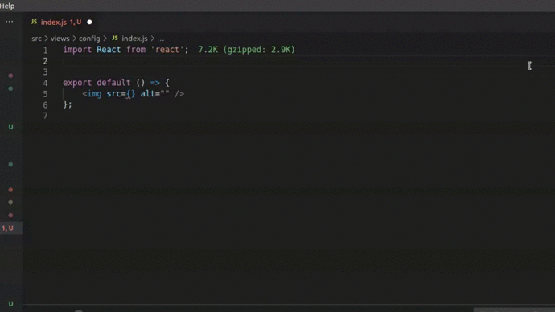
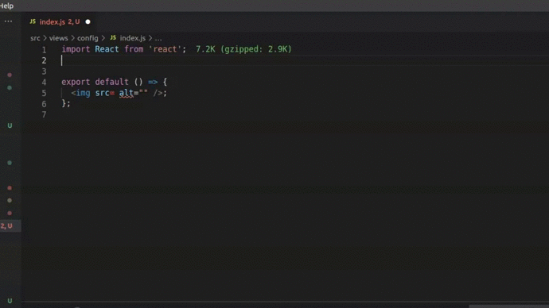

# JS Relative Import
  

---

An easier way to **navigate and find files** to import in your javascript project. Search for a file or navigate through a tree view to find the file you wish to import.

---

Press **Ctrl+Shift+Space** (if it don't work, press **Ctrl+Shift+P** and search for **JS Relative Import**) and find the file you wish to import in a tree view.
 

 
 
You can also **search** through the files.
 

## Installation
Open VSCode and search for **JS Relative Import** on Extensions tab.

## Changelog
To check full changelog [click here](CHANGELOG.md).

## License
This extension is licensed under the [MIT License](LICENSE)
